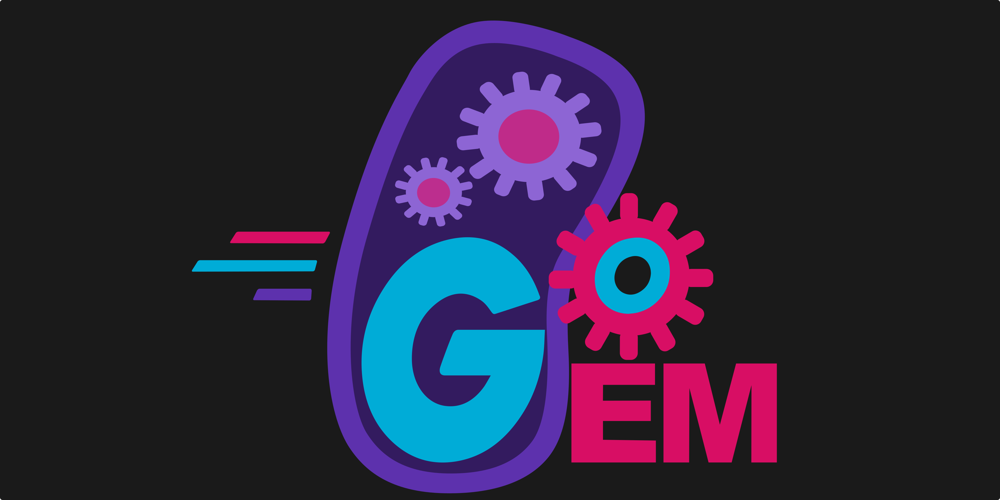

# GoGEM-WikiAPI

## 

The GoGEM Module will enable iGEM Teams to completely design and maintain their Wiki via a WordPress instance.

This Module contains the functions that enable communications with the iGEM-Servers.

**For detailed information about this tool visit our [iGEM Wiki](https://2021.igem.org/Team:TU_Darmstadt/software) and check out the [wiki guide](https://2021.igem.org/wiki/images/7/70/T--TU_Darmstadt--GoGEM-How-to-Wiki-the-Darmstadt-Way.pdf)!**

---

For the most recent version of the API visit the GoGEM [GitHub Repo](https://github.com/Jackd4w/GoGEM)!

---

This is not standalone software, to finde the standalone projects _Judging Release_ visit the [iGEM GoGEM Repo](https://github.com/igemsoftware2021/TU_Darmstadt-GoGEM).

## Required Packages

Directly required non standard packages:

* [GoQuery](https://github.com/PuerkitoBio/goquery)
* [Net](https://golang.org/x/net)
